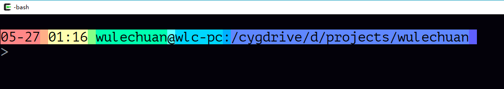
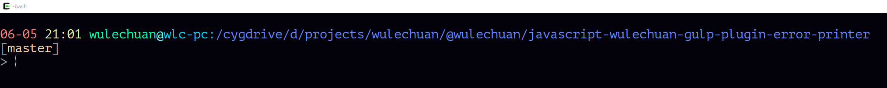
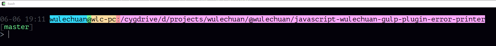

<link rel="stylesheet" href="./docs/styles/markdown-preview-in-ms-vscode.css">

# 概述

令 Bash 类环境拥有彩虹般美丽的命令提示符。

作者：吴乐川 [wulechuan@live.com](mailto:wulechuan@live.com)

  \
作者提供的示例（256 色模式下）

<br>

  \
作者提供的示例2（256 色模式下）

<br>

  \
作者提供的示例（16 色模式下），色值表已被自定义，因此看起来较艳丽。

<br>


本工具用以在兼容 Bash 的【命令行环境】构建如图所示的彩色【命令提示符】。

它采用 Bash 语法，因此适用于 Linux 终端、苹果 macOSX 终端、Windows Subsystem for Linux (WSL) 环境，以及各类【Linux 终端模拟器】（如 GitBash 和 Cygwin ）。

它**不**适用于微软 Windows CMD，也**不**适用于微软 Windows
PowerShell，或微软针对 Linux 平台推出的
PowerShell。因为 CMD 与 PowerShell 二者的的语法与 Bash 大相径庭。

> 另注：
> 
> 在 Windows 平台上，【Windows 控制台】程序通常被粗略的（或者说错误的）视为
> CMD 和 PowerShell。实际上，应该说 CMD 和 PowerShell 运行于【Windows
> 控制台】内。或者更准确的说，二者仅将【Windows
> 控制台】作为二者的输入输出界面。毕竟，计算机软件领域“内”与“外”的概念往往仅是借喻罢了。


# 特色

1.  【提示符】的字符串【主体】恰好是创建【ssh】连接所须的字符串，便于命令行用户构建【ssh】连接。
2.  显示日期和时间戳，以便追踪历史命令。
3.  独特的彩色条带，在命令历史记录之间形成天然的视觉分隔带，便于终端用户回溯历史时，借助视觉本能加速探寻信息。
4.  美观（但这很主观，每个人看法不尽相同）。


# 安装

1.  将整【本项目仓库内的 `~` 文件夹】内的 `bash-rainbow-prompt` 文件夹复制到系统或模拟器环境的 `~` 文件夹下。

2.  如果 `~` 文件夹下不存在 `.bash_profile` 则创建之。
    > 注意文件名要以英文句点 `.` 开头。

3. 编辑 `~/.bash_profile` 文件，在其中加入以下语句：

    ```sh
    source ~/bash-rainbow-prompt/load.sh
    ```

    保存该文件。

    > 注意：如果你很熟悉 Bash 类环境的配置，且已经配置好令你的
    > `~/.bash_profile` 加载 `~/.bashrc`
    > 文件，则对于上述 2、3 两个步骤，亦可以改为修订
    > `~/.bashrc` 文件，而令你已有的`~/.bash_profile` 保持不变。

4.  令上述配置生效，有两种方法：

    1.  上述配置在任何**新打开**的 Bash 窗口均会**自动生效**。

    2.  对于**已经打开**的 Bash 窗口，可在其中执行：

        ```sh
        exec bash -l
        ```


# 关于 `git-prompt.sh`

本工具提供“显示 git 分支状态细节”的选项，但该功能须借助知名的工具—— `git-prompt.sh`。
`git-prompt.sh` 这一工具的许可协议为 GNU GPL
2.0。而我不打算为为我自己的“彩虹提示符”工具提供什么许可协议，因此我不能直接包含那个
`git-prompt.sh` 工具。抱歉。

如果你需要开启这一特性，请自行下载 `git-prompt.sh`
文件（没错，它是单一文件），并将其置于该文件夹下：
```sh
~/bash-rainbow-prompt/GNU-tools
```
也就是说，文件的完整路径如下：
```sh
~/bash-rainbow-prompt/GNU-tools/git-prompt.sh
```

> 见 https://github.com/git/git/blob/master/contrib/completion/git-prompt.sh

另，尽管 `git-prompt.sh` 工具能提供详尽的 git
分支状态信息，其代价是在被配置为 git 的文件夹内，每次显示命令行时，都会引发网络请求，以获取当前
git 分支最新的状态细节。这将导致 Bash 命令提示符的显示明显延后，令人不悦。

因此，**望诸君依自身喜好与实际情况选用之**。


# 按需配置

## 配置文件

本工具的配置文件为
```sh
<本代码仓库>/~/bash-rainbow-prompt/configurations.sh
```
其中有若干【可配置项】，修订这些项的取值，可改变【提示符】的外观。


## 可配置项

### `shouldUseDetailedButSlowBranchInfoQueryInPrompt`

该变量用于控制是否借助 `git-prompt.sh` 来显示当前 git 分支的状态细节。

允许的取值：任何值均可。其中，仅【`yes`】代表“启用‘显示 git 分支状态细节’的功能”。该变量亦可被省略（即【无定义】），此时等同于【非 `yes`】值。


### `wlcRainbowPromptColorsAreInBackgroundButNotTexts`

该项控制【提示符】的着色方式。如果省略，则默认值为 `'yes'`。

当该值省略（未定义）时，或其取值为 `'yes'` 时，效果如下图所示：


当该值**不**取 `'yes'` 时，效果如下图所示：


### `wlcRainbowPrompt256Colors_color[n]`

目前有 10 个这样的颜色配置项：
```sh
wlcRainbowPrompt256Colors_color1=210
wlcRainbowPrompt256Colors_color2=216
wlcRainbowPrompt256Colors_color3=229
wlcRainbowPrompt256Colors_color4=120
wlcRainbowPrompt256Colors_color5=49
wlcRainbowPrompt256Colors_color6=87
wlcRainbowPrompt256Colors_color7=45
wlcRainbowPrompt256Colors_color8=39
wlcRainbowPrompt256Colors_color9=69
wlcRainbowPrompt256Colors_color10=63
```

它们依次代表【提示符】从左至右采用的 10 种颜色。


### `wlcRainbowPrompt256Colors_colorGitBranchInfo[n]`

目前有 2 个这样的颜色配置项：
```sh
wlcRainbowPrompt256Colors_colorGitBranchInfo1=219
wlcRainbowPrompt256Colors_colorGitBranchInfo2=223
```

-   其中 1 号颜色用于 `wlcRainbowPromptColorsAreInBackgroundButNotTexts`
    被省略（不定义）或取值为 `'yes'` 的情形；

-   2 号颜色用于 `wlcRainbowPromptColorsAreInBackgroundButNotTexts`
    取值不为 `'yes'` 的情形。


> 该两种颜色，不论哪一种被采用，均仅应用于 git 分支信息的【文字】，而不用于背景。


### `wlcRainbowPrompt256Colors_colorGitBranchInfoBrackets`

用于控制 git 分支信息两旁的方括号的颜色。

> 该颜色总是用于方括号字符上，不会用于方括号的背景。


# 参见

-   `git-prompt.sh` 源文件：
    https://github.com/git/git/blob/master/contrib/completion/git-prompt.sh
-   我写的另一个实用工具——`bash-colorful-strings`：
    https://github.com/wulechuan/bash-colorful-strings


# 附录

## 自定义色值表

本工具附带了一套自定义【色值表】。诸君如不嫌弃，不妨一试。此表存于该文件中：
```sh
<本代码仓库>/~/.mintty/themes/bash16-wulechuan.minttyrc
```

在 `256 色模式`终端下，如果采用了 256
色的【命令提示符】，则**不必修订色值表**，该色值表文件也毫无用处。因为
256 色模式终端的 256 色色值表是固定不变的，**无从修改**。

在 `8 色模式`的终端（但实际上提供 16 种颜色）下，**或者**在 `256 色模式`的终端下**仅打算利用标准的 16
色表**的情况下，你不妨修订系统默认的色值表，形成自己喜爱的配色主题，使最终效果更美观。

> 8 色模式下，每“种”颜色允许【明】、【暗】两种变体，因此总共有 16 色。


### 色值表的用法

16 色色值表的使用因环境而异。有些环境可以直接采用置于特定文件夹中的
`.minttyrc` 文件并生效；另有一些环境，例如 Windows
控制台，则无法直接应用该类文件，而必须手工将文件中各颜色值逐一取出，填入配置对话框中。

#### 色值表在【Cygwin for Windows】中的用法

1.  将本代码库中的 `~/.mintty` **文件夹**完整复制到 `~` 文件夹内。

    > 注1：并非复制单一的主题文件，而是复制整个文件夹，且须保存文件夹内部结构。

    > 注2：Cygwin 一般将 `%UserProfile%` 文件夹视为 `~` 文件夹。


2.  运行 Cygwin。

3.  鼠标右键点击 Cygwin 窗口的标题栏，点选【Options...】。这将打开 mintty
    的【Options】对话框。

4.  在对话框左侧的导航栏找到第一项【Looks】，点选之。

5.  在名为【Theme】的下拉列表框中选用 `base16-wulechuan.minttyrc`。

6.  点击对话框中的【Save】按钮或【Apply】按钮。


#### 色值表在【Windows 控制台】中的用法

尽管我的这一“bash-rainbow-prompt”工具**并不**适用于微软的 Windows CMD 或 PowerShell
环境，我提供的色值表却可以用于配置微软 Windows 控制台程序。只不过配置过程须手工完成。而且不难想象，该动作将同时影响 CMD 和 PowerShell。

1.  运行 CMD 或 PowerShell，以打开一个【Windows 控制台】窗口。

2.  鼠标【右键】点击【Windows 控制台】窗口的标题栏，点选【默认值】。这将打开【控制台窗口 属性】对话框。

3.  进入第四个标签，即【颜色】标签，将 `.mintty/themes/base16-wulechuan.minttyrc`
    中的色值逐一配置到【控制台窗口 属性】对话框中。
    > 注：`base16-wulechuan.minttyrc` 文件中的色值【自上而下】的顺序恰好与
    > Windows 控制台中各色块【自左至右】的顺序吻合。

1.  点击【确定】按钮，以保存色彩配置。随即可见 Windows 控制台中，各内容的颜色变更。
